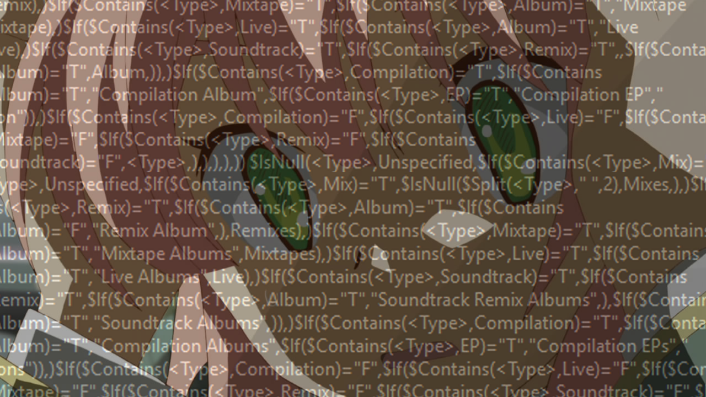

# MusicBee Function Converter

A program that makes MusicBee functions easier to write. Also an exercise in learning Rust.

Currently: Doesn't do anything

In the future: Will take a txt file with simpler commands and output a txt file with copy-pastable musicbee functions.
